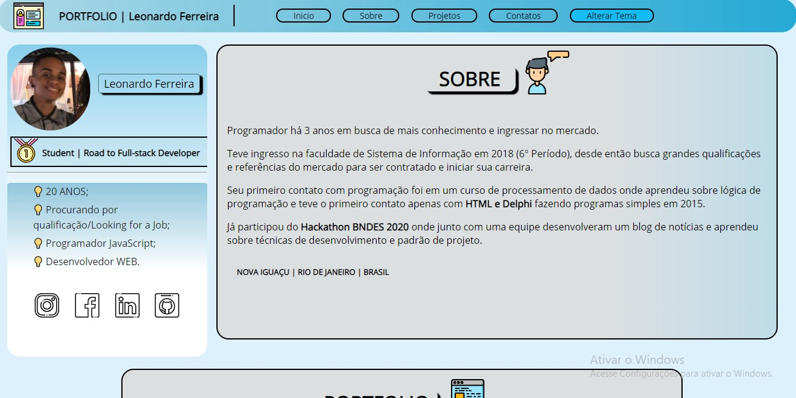
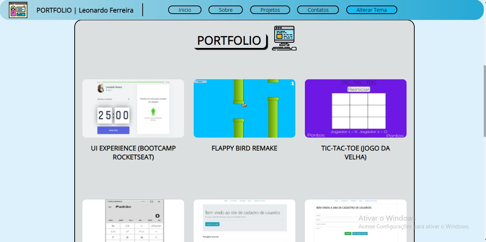
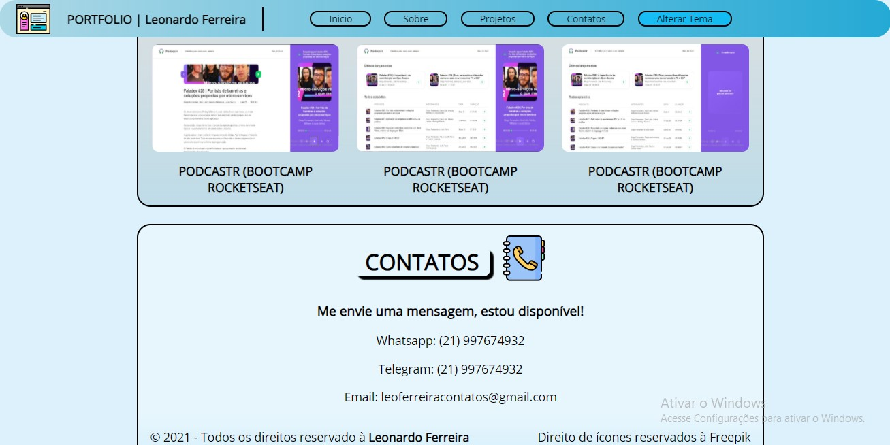
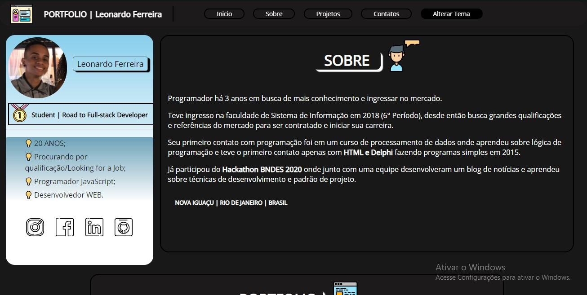
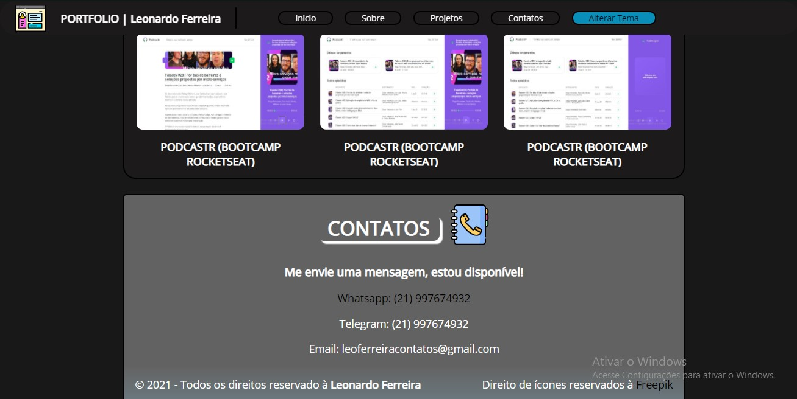

 <h1 align="center" style="color: #afb2b1"> PORTFOLIO LEONARDO FERREIRA </h1>

## ⚙️ Tecnologias utilizadas: 
✔️ [Node.JS](https://nodejs.org/en/)  
✔️ [Handlebars](https://handlebarsjs.com)  
✔️ [JQuery](https://jquery.com)  
✔️ [Express](https://expressjs.com/pt-br/)  

## 💻 USABILIDADE | 📷 Screenshots 

## 💡 Projeto

 Este é um projeto pessoal onde eu incluo outros projetos pessoais para ganhar notoriedade e compartilhar minhas habilidades. 

## 📍 Como utilizar 

 Se você é um desenvolvedor e quer utilizar o App em sua maquina local basta instalar as dependencias e executar o comando:  
<h3> 🔍 -- npm run dev -- ou -- yarn dev -- rodando na porta 3031.</h3>

 Para instalar as dependencias basta utilizar o comando:  
<h3> 🔍 --npm-- ou --yarn-- ou se preferir visualize o arquivo "Package.json". </h3>

## 📢 Atualizações 

 Este é meu portfolio pessoal, se você quiser contribuir basta puxar um fork e desenvolver em uma branch separada, toda a ajuda, feedback e crítca é aceita! 🚀🚀🚀 

## 📲 Redes sociais

🔗 [LinkedIN](https://www.linkedin.com/in/leonardo-ferreira-253a60173/)  
🔗 [Whatsapp](https://api.whatsapp.com/send?phone=5521997674932)  
🔗 [Facebook](https://www.facebook.com)  
🔗 [Reddit](https://www.reddit.com)
